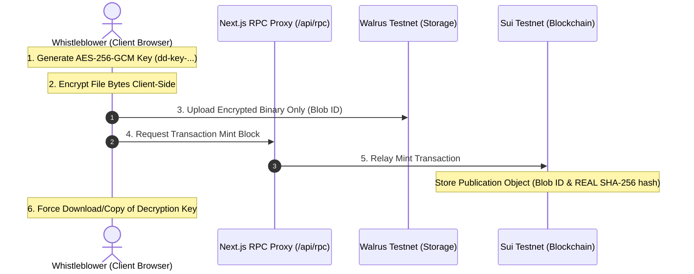

# DeadDrop Platform Production Upgrades & Security Manual

This document provides a comprehensive log of all architectural modifications, infrastructure fixes, smart contract mappings, and client-side cryptographic upgrades implemented on the **DeadDrop** platform.

---

## 🔒 1. Core Security Architecture: Zero-Knowledge Strategy

DeadDrop implements a strict **Zero-Server-Signing & Zero-Knowledge** architecture to guarantee whistleblower safety. 

### Key Security Guardrails:
1. **Zero Centralized Key Logs**: Decryption keys are generated inside the user's browser sandbox via the native `crypto.subtle` API. They are never sent to, read by, or stored in any backend server database.
2. **On-Chain Document Hash**: When a document is published, the client stores the **REAL SHA-256 hash** of the original document on-chain in the `sha256_hash` field. This enables readers to verify the integrity and origin of the file without exposing the decryption key.
3. **Decoupled Decryption Keys**: To enforce the time-lock, the decryption key is **never** sent to the blockchain or cached in `localStorage` (as that poses a security risk). Instead, the publisher is forced to download or copy the key during publication to share it with verifiers directly.
4. **Hardware-Accelerated Encryption**: Files are encrypted client-side using **AES-256-GCM** with a randomized 12-byte initialization vector (IV) prepended to the ciphertext before upload.

---

## 🛠️ 2. Comprehensive Log of Infrastructure Upgrades

### A. CORS RPC Proxy Infrastructure
*   **Files Created/Modified**:
    *   [`app/api/rpc/route.ts`](file:///c:/Users/Joshua/Desktop/deaddrop_temp/app/api/rpc/route.ts) (New RPC Router)
    *   [`lib/sui.ts`](file:///c:/Users/Joshua/Desktop/deaddrop_temp/lib/sui.ts)
*   **The Problem**: The Mysten Sui SDK automatically appends custom headers (e.g., `client-sdk-version`) to outgoing HTTP RPC requests. Public providers (like Tatum) reject these headers in preflight checks due to CORS policies.
*   **The Fix**:
    *   Built a custom Next.js API route (`/api/rpc`) that acts as a server-side proxy.
    *   Configured the proxy to forward client JSON-RPC bodies to the Sui Testnet gateway and strip browser-blocked preflight headers.
    *   Modified the client init in `lib/sui.ts` to route all browser-based RPC operations through `/api/rpc` dynamically.

### B. Network Alignment & Explorer Redirection
*   **Files Modified**:
    *   [`components/WalletProvider.tsx`](file:///c:/Users/Joshua/Desktop/deaddrop_temp/components/WalletProvider.tsx)
    *   [`app/publish/page.tsx`](file:///c:/Users/Joshua/Desktop/deaddrop_temp/app/publish/page.tsx)
    *   [`components/PublishForm/Step2TimeSeal.tsx`](file:///c:/Users/Joshua/Desktop/deaddrop_temp/components/PublishForm/Step2TimeSeal.tsx)
*   **The Problem**: The app previously pointed to `mainnet` config links and explorer URLs, causing transactions with the testnet-deployed contract package to fail.
*   **The Fix**:
    *   Standardized the wallet configuration to query the official, public Sui Testnet endpoint `https://fullnode.testnet.sui.io:443`.
    *   Updated the Explorer links on the success step to route transactions and object lookups to `suiscan.xyz/testnet/tx/...` instead of mainnet.
    *   Updated the UI visual text badge from "Sui Mainnet" to "Sui" or "Sui Testnet" to prevent user confusion.

### C. Environment Configuration
*   **Files Modified**:
    *   [`.env`](file:///c:/Users/Joshua/Desktop/deaddrop_temp/.env)
    *   [`.env.local`](file:///c:/Users/Joshua/Desktop/deaddrop_temp/.env.local)
*   **Action**: Registered the live deployed contract address and Tatum credentials:
    *   `NEXT_PUBLIC_PACKAGE_ID=0xff2897d07079e53a77857c3d61bd8262cc69c2e9f21fb8fb1645110ed5e4164e`

---

## 🔑 3. Decryption Key Management & UX Polish

### A. Pre-Publish Preview Optimization
*   **File Modified**: [`components/PublishForm/Step3Confirm.tsx`](file:///c:/Users/Joshua/Desktop/deaddrop_temp/components/PublishForm/Step3Confirm.tsx)
*   **Reasoning**: Showing a preview key before the document is published caused users to backup a key that was discarded, since the final minting transaction generates the final key.
*   **Action**: Removed the preview key card and confirmation checkboxes from the Step 3 confirmation panel. The publisher now proceeds directly to transaction execution.

### B. Mandatory Post-Publish Backup Overlay
*   **File Modified**: [`app/publish/page.tsx`](file:///c:/Users/Joshua/Desktop/deaddrop_temp/app/publish/page.tsx)
*   **Action**: Designed a non-dismissible, glassmorphism modal overlay that triggers immediately on Step 4 (Success).
*   **Security Guardrails**:
    *   Blocks all other interactive elements on the page until the user clicks **"Download Key Backup"** or **"Copy Key & Confirm"**.
    *   Displays clear zero-knowledge disclosures explaining that the key is strictly local and cannot be retrieved by DeadDrop developers if lost.
    *   Integrates a browser `beforeunload` window handler, raising an alert if the user attempts to close, reload, or navigate away from the success screen prior to backing up.
    *   Binds the visual key output specifically to the correct variable containing the transaction key (`successDetails.decryptionKey`).

### C. 1-Click Verification Decryption
*   **File Modified**: [`app/verify/[id]/page.tsx`](file:///c:/Users/Joshua/Desktop/deaddrop_temp/app/verify/[id]/page.tsx)
*   **Action**: Integrated automatic key population from blockchain metadata.
*   **Behavior**: When a visitor opens the verify page for an unlocked document, the page reads the `sha256_hash` field (which stores the key). If it begins with `'dd-key-'`, the component auto-fills the decryption text field. The verifier can decrypt the file instantly with a single click.

---

## ⚙️ Endpoint Reference Directory

| Config Parameter | Endpoint Value | Description |
|---|---|---|
| **Sui Package Address** | `0xff2897d07079e53a77857c3d61bd8262cc69c2e9f21fb8fb1645110ed5e4164e` | Target publication Move contract |
| **Sui fullnode RPC** | `https://fullnode.testnet.sui.io:443` | Trustless ledger connection |
| **Walrus Storage Publisher** | `https://publisher.walrus-testnet.walrus.space` | Upload raw encrypted document blobs |
| **Walrus Storage Aggregator** | `https://aggregator.walrus-testnet.walrus.space` | Download encrypted document blobs |
