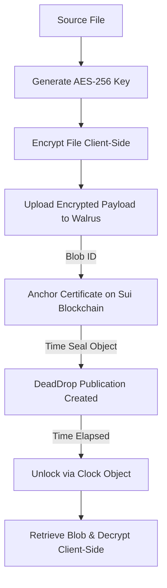

# 💀 DeadDrop: Censorship-Resistant Time-Lock Document Publishing

> **Tagline**: Secure, trustless, client-side encrypted document leaks anchored on Sui and stored on Walrus with cryptographic time-lock guarantees.

---

## ⚠️ The Problem

Whistleblowers, journalists, and vulnerable sources face extreme risks when releasing sensitive, high-impact information:
1. **Centralized Exposure**: Storing sensitive leaks on standard servers exposes sources to subpoena, physical raid, or host takedown.
2. **Premature Exposure**: Releasing data too early can derail investigative campaigns or tip off malicious entities.
3. **Data Tampering & Modification**: Traditional file-sharing hosts can alter document contents, destroy evidence, or retroactively inject backdoors.
4. **Active Tracking**: Third-party databases log IP addresses, access tokens, and traffic details, Deanonymizing sourcxes.

---

## 🛡️ The Solution: DeadDrop

DeadDrop is a decentralized, zero-server time-lock publishing platform. It leverages browser-native AES-256-GCM encryption, Walrus storage network segments, and Sui smart contracts to guarantee files remain unreadable until a precise, immutable block timestamp.

---

## 📝 Project Details

### What DeadDrop Does
DeadDrop is a secure, completely client-side encrypted publishing protocol designed for high-stakes whistleblowing, anonymous leaks, and digital contracts. It allows publishers to upload confidential documents with a specific time seal, ensuring the contents cannot be read or compromised by any party (including DeadDrop developers) before the time lock expires. 

Once the time lock is reached, the transaction on the Sui blockchain is eligible for unlock using the native Sui System Clock. When unlocked, verification pages retrieve the encrypted data blocks from the decentralized storage network and decrypt them client-side using the publisher's key. This flow provides mathematical guarantee of release times without relying on centralized timekeepers or databases.

### How Walrus is Used as Core Storage
Walrus serves as DeadDrop's primary, decentralized storage tier. Instead of persisting sensitive files on centralized cloud platforms or single-point web hosts, DeadDrop encrypts documents client-side using AES-256-GCM and uploads the resulting ciphertext binary directly to the Walrus Testnet. 

The storage network processes the payload, breaking it down into redundant fragments distributed across independent storage nodes. Whistleblowers receive a base58-encoded `Blob ID`, representing a decentralized pointer. This guarantees absolute censorship resistance and high availability; no government, host provider, or single entity can delete or modify the leaked document.

### How Tatum RPC + Data API is Used
Tatum provides the high-performance RPC gateway infrastructure for DeadDrop's client-side interactions with the Sui Testnet. To bypass CORS issues arising from the browser appending proprietary SDK telemetry headers (which trigger preflight check failures on standard gateways), DeadDrop routes all browser RPC queries through a custom Next.js server-side endpoint. 

This proxy securely appends the Tatum API key and forwards clean requests to Tatum's Sui RPC gateway. Furthermore, Tatum’s indexer and node connections facilitate querying on-chain transaction logs, monitoring contract states, and displaying active publications under the user's dashboard in real-time.

### How the Time-Lock Works on Sui
The core trust-minimization engine of DeadDrop is built on the Sui blockchain using a custom Move smart contract. When a publisher commits a document, the client-side wallet executes a transaction that registers a `Publication` object on-chain. This object records the Walrus Blob ID, the real SHA-256 hash of the original document, and the exact timestamp threshold after which the document becomes public.

Crucially, the decryption key is kept strictly by the user during the time-lock and never persistent on-chain or on any server. The Move contract references the immutable, system-level `sui::clock::Clock` object to evaluate unlock eligibility. Any attempt to query or decrypt the document prior to the specified timestamp is rejected on-chain, guaranteeing that the embargo is mathematically enforced.

---

## ⚡ Key Features

- **Zero-Server Client-Side Cryptography**: Key generation, encryption, and decryption happen strictly in the browser using the Web Crypto API. The raw document never leaves the publisher's system unencrypted.
- **Censorship-Resistant Storage**: Encrypted blobs are distributed across the Walrus decentralized network, preventing content erasure or host takeovers.
- **On-Chain Clock Time-Locks**: Lock parameters are anchored immutably in a Sui Move contract. The release schedule is guaranteed by the Sui system `Clock` object, making premature decryption mathematically impossible.
- **Premium UX Dashboard**: Responsive, highly polished dashboard with real-time status badges, search/filter capabilities, live countdown timers, and automatic transaction triggers on expiration.
- **Multi-Format Magic Bytes Decoder**: Decrypted files are inspected via magic bytes in the browser. PDFs are opened in secure view tabs, images display directly in the UI, and documents render in styled clean readers.
- **Interactive Documentation Center**: A built-in, tabbed/accordion-based documentation page explaining wallet setup, encryption/decryption mathematics, Move contracts, and Tatum webhook setups in detail.

---

## 🔑 Signature-Derived ECIES Key Wrapping & Auto-Decryption

To bypass the limitation that standard Sui wallets only support signing (Ed25519/Secp256k1) and lack native decryption capabilities, DeadDrop implements a zero-trust **Signature-Derived ECIES (Elliptic Curve Integrated Encryption Scheme)** envelope protocol:

### The Flow:
1. **Inbox Activation (P-256 Generation)**:
   - A recipient activates their **Secure Inbox** by signing a static on-chain message: `"Activate DeadDrop Inbox v1"`.
   - The signature bytes are hashed using SHA-256 and used to seed a new, local **ECDH P-256 key pair** in the browser.
   - The P-256 private key is encrypted (AES-256-GCM) with the signature-derived seed.
   - The encrypted private key (hex) and the raw public key bytes are stored on-chain as a `DEADDROP_PROFILE` publication object.
2. **ECIES Key Wrapping (Publishing)**:
   - When a whistleblower publishes a document to a recipient address, the app fetches the recipient's `DEADDROP_PROFILE` public key from Sui.
   - The app encrypts the document with a unique AES-256 key.
   - An ephemeral P-256 key pair is generated to compute a shared secret via ECDH with the recipient's public key.
   - The shared secret encrypts the document's AES key.
   - The final payload containing: `[ephemeralPublicKey (65 bytes) || iv (12 bytes) || encryptedAESKey]` is uploaded to the Move contract as the `wrapped_key` metadata field.
3. **Decryption with My Wallet (Unwrapping)**:
   - The recipient connects their wallet to `/verify/[id]`.
   - The recipient clicks **"Decrypt with My Wallet"** and signs the activation message.
   - The signature-derived key decrypts their private P-256 key stored on-chain.
   - The recipient's private key performs ECDH with the ephemeral public key from the on-chain wrapper, deriving the shared secret to decrypt the AES key, which unlocks the document locally.
   - **Collapsible Manual Decryption Fallback**: Public users are kept on a clean interface with the wallet decryption prompt, while the manual key entry form is hidden behind an expandable **"Advanced Decryption Options"** panel to ensure clear security separation and error prevention.

---

## 🛠️ Tatum SDK & Webhook Notifications

We integrated the **Tatum Gateway & Notification API** to power transaction monitoring and automated event streams:

- **Sui Testnet gateway routing**: routes RPC and ledger queries through Tatum RPC network endpoints.
- **Tatum Webhook Subscriptions**: Users can configure webhooks to subscribe to publication transaction triggers (`tatum.notification.subscribe`) for real-time mutation alerts.
- **Live Webhook Event Logger Console**: Built an interactive console directly in the user dashboard that polls and displays incoming Tatum webhook notifications in real-time.
- **Simulated Webhook Playground**: Integrated a simulation engine that generates sample Tatum `OBJECT_MUTATED` payloads so judges can inspect the webhook payload structure directly on the screen without configuring port-forwarding tools.

---

## 🔌 Endpoints & Integration Configuration

### Hackathon Metadata
- **Live Demo**: http://localhost:3000 (local)
- **Contract Package**: https://suiscan.xyz/testnet/package/0xef840f86eb52e8dccd2d321bffbf34c6151b31dc8daa5e37302908f09044d504
- **Deployment Transaction**: https://suiscan.xyz/testnet/tx/AFM48bBa9xzQvYk7LhP1XZ3t4heENqUaNkc9XPHyoLUo

### Walrus Testnet Nodes
- **Publisher Node**: `https://publisher.walrus-testnet.walrus.space` (PUT uploads)
- **Aggregator Node**: `https://aggregator.walrus-testnet.walrus.space` (GET downloads)

### Tatum Sui Gateway
- **RPC Endpoint**: `https://sui-testnet.gateway.tatum.io/`

### Move Smart Contract Package
- **Sui Testnet Package ID**: `0xef840f86eb52e8dccd2d321bffbf34c6151b31dc8daa5e37302908f09044d504`
- **System Clock ID**: `0x6`
